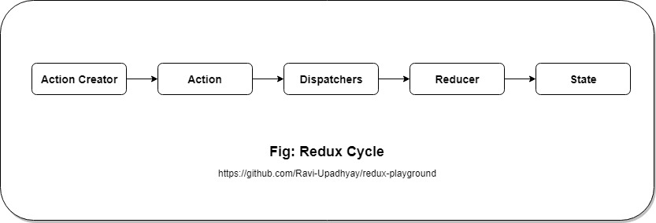

# Redux

> React is a state management library which makes creating complex web application easier. 

- It provides great development experience with redux devtools.
- It helps to make testing easier.
- It provides you the flexibility to use unopinionated and opinionated.
- 
___

## Index
- [Philosophy of Redux](#philosophy)
- [When to use Redux](#when-redux)
- [Code snippets](#code-snippets)
- [Resources over web](#resources)
- [To do list](#to-do)

___

## Philosophy of Redux

### The redux flow: 

To understand the philosophy behind the redux, one need to understand the redux flow. Every time to change the state same flow will be followed.

#### The bird's eye view:

- The whole `state` of your app is stored in an *object tree inside a single store*.
- The only way to change the `state` tree is to emit an `action`, an object describing what happened.
- To specify how the actions transform the `state` tree, you write pure `reducers`.

___

## When to Redux

Redux is a valuable tool for managing the state, but this also has certain trade offs. One should always take time and consider according to the needs. Although these guides are subjective and vague. 

- You have reasonable amounts of data changing over time.
- You need a single source of truth for your state.
- You find that keeping all your state in a top-level component is no longer sufficient.

___

## Code Snippets

1. <!-- link to code snippets -->

---

## Resources Over Web

1. [Redux official](https://redux.js.org/introduction/getting-started)
2. [Redux starter kit - opinionated](https://redux-starter-kit.js.org/)
3. [Redux devtools](https://github.com/reduxjs/redux-devtools)
4. [Redux video tutorial, Dan Abramov - Creator of Redux](https://egghead.io/courses/getting-started-with-redux)
5. [Redux video tutorial, Dan Abramov - Creator of Redux (Advanced)](https://egghead.io/courses/building-react-applications-with-idiomatic-redux)
6. [Redux Fundamentals, Mark - Co-maintainer of Redux](https://blog.isquaredsoftware.com/2018/03/presentation-reactathon-redux-fundamentals/)
7. [Redux Fundamentals, Mark - Co-maintainer of Redux (Advanced)](https://blog.isquaredsoftware.com/series/practical-redux/)
   

---

## To do list

1. Top most section Redux needs to be updated as definition and objectives become more clear.